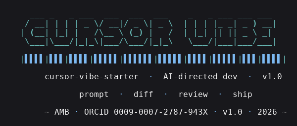

# cursor-vibe-starter

[](https://doi.org/10.5281/zenodo.XXXXXXX) <!-- DOI placeholder; replaced on first Zenodo deposit -->
[](LICENSE)
[](#tests)
[](#prompt-templates)



A reference workspace for **AI-directed development** in security
engineering. Three things in one repo:

1. **`.cursorrules`** — an opinionated, working configuration for Cursor
   IDE. Style, security, testing, and framework preferences as a single
   contract the model has to follow.
2. **`prompts/01_*.md` … `prompts/12_*.md`** — twelve prompt templates,
   each with the same five-part structure: *Context · Template ·
   Example · Expected Output · Common Pitfalls*.
3. **`example/security-microservice/`** — a complete, runnable FastAPI
   service built using the prompts and the rules: JWT auth, Redis
   rate-limiting, structured JSON logging, 20 passing pytest cases,
   `docker compose up` to run.

Plus: a `metrics/loc_analysis.py` that parses *this repo's own
git log* to break commits into `[ai]` / `[manual]` / `[mixed]` /
`[tooling]` buckets. The methodology is documented; the numbers are
measured, not claimed.

> The single-number reader sometimes wants — *"how much faster did AI
> make you?"* — isn't here, and won't be. What this repo offers is
> something more modest: a record of what shipped, broken down by
> workflow, with the rules and prompts that produced it.

---

## Quickstart

### 1. Read the rules

Open [`.cursorrules`](.cursorrules) in Cursor (or any editor). It
defines the contract for AI-pair-coded changes in this codebase:
type-hint discipline, security non-negotiables (no hardcoded secrets,
parameterised SQL, JWT alg-confusion guards), testing requirements,
framework preferences, and a list of explicit "don't"s.

<a id="prompt-templates"></a>
### 2. Skim the prompt library

```
prompts/01_api_design.md
prompts/02_security_review.md
prompts/03_test_generation.md
prompts/04_docker_setup.md
prompts/05_database_schema.md
prompts/06_auth_flow.md
prompts/07_error_handling.md
prompts/08_logging_setup.md
prompts/09_ci_pipeline.md
prompts/10_refactor.md
prompts/11_documentation.md
prompts/12_incident_response.md
```

Each one is a copy-pasteable template plus a worked example plus a
list of *what to watch for in the AI's output*. The Common Pitfalls
section is where most of the value lives — the bugs AI tools tend to
introduce when given that prompt unchecked.

### 3. Run the worked example

```bash
cd example/security-microservice
cp ../../.env.example .env
# generate a real JWT secret — the service refuses placeholder ones
python -c "import secrets; print('JWT_SECRET=' + secrets.token_urlsafe(64))" >> .env

docker compose up -d
sleep 5
curl -fsS http://localhost:8080/health
```

You should see `{"status":"ok","app":"security-microservice","version":"1.0.0"}`.

End-to-end smoke:

```bash
# log in (demo user; password is just <username>_pw)
TOKEN=$(curl -sS -X POST http://localhost:8080/v1/auth/login \
    -H 'content-type: application/json' \
    -d '{"username":"alice","password":"alice_pw"}' \
    | python -c 'import json,sys; print(json.load(sys.stdin)["access_token"])')

# submit a scan
curl -sS -X POST http://localhost:8080/v1/scans \
    -H "Authorization: Bearer $TOKEN" \
    -H 'content-type: application/json' \
    -d '{"target":"nist.gov","profile":"quick"}'
```

---

## What's in `example/security-microservice/`

```
example/security-microservice/
├── main.py                 # FastAPI app factory + lifespan
├── config.py               # pydantic-settings; refuses placeholder JWT secrets
├── auth.py                 # JWT mint/decode + constant-time login
├── models.py               # Pydantic request/response shapes (FQDN validator)
├── scan_store.py           # Redis-backed scan store
├── redis_dep.py            # FastAPI dependency-injectable redis client
├── logging_config.py       # JSON logs + RedactingFilter for secret hygiene
├── routes/
│   ├── health.py           # GET /health (sidecar-independent liveness)
│   ├── auth.py             # POST /v1/auth/login
│   └── scan.py             # POST /v1/scans, GET /v1/scans, GET /v1/scans/{id}
├── middleware/
│   ├── request_logger.py   # request-id + access logs
│   └── rate_limiter.py     # per-JWT token-bucket rate limiter
├── tests/                  # 20 pytest cases (auth, scan, health, rate, redaction)
├── Dockerfile              # multi-stage; non-root uid 10001; healthcheck
├── docker-compose.yml      # app + redis (pinned to redis:7-alpine)
└── requirements*.txt
```

### Endpoints

| Method | Path                  | Auth     | Purpose                              |
|--------|-----------------------|----------|---------------------------------------|
| GET    | `/health`             | none     | Liveness probe (skips rate limiter)  |
| POST   | `/v1/auth/login`      | none     | Username + password → JWT bearer     |
| POST   | `/v1/scans`           | Bearer   | Submit a scan request                |
| GET    | `/v1/scans/{id}`      | Bearer   | Retrieve one scan (own scans only)   |
| GET    | `/v1/scans`           | Bearer   | List the caller's scans              |

Errors all return the same envelope:

```json
{"error": {"code": "auth.bad_credentials", "message": "invalid username or password"}}
```

Stable codes: `auth.bad_credentials`, `auth.expired`, `auth.invalid`,
`auth.bad_alg`, `scan.not_found`, `rate.limited`, `request.invalid`.

---

<a id="tests"></a>
## Tests

20 pytest cases. Full suite runs in ~3 seconds.

```bash
pip install -r example/security-microservice/requirements-dev.txt
JWT_SECRET="$(python -c 'import secrets; print(secrets.token_urlsafe(64))')" \
  python -m pytest example/security-microservice/tests/ -v
```

Coverage:
- **auth** — happy path, wrong password, unknown user (same code: prevents enumeration), expired token, tampered token, **alg=none token rejected** (the JWT alg-confusion bug)
- **scan** — create+fetch round-trip, FQDN validation rejects URLs and shell metacharacters, 404 on unknown id, **per-user scope** (alice's scans don't appear in bob's listing)
- **rate limiter** — 429 with `Retry-After: 60`, `/health` exempt under load
- **logging redaction** — `Authorization` and `X-API-Key` redacted to `***` even when accidentally passed through `extra={"headers": ...}`
- **health** — request-id propagated end-to-end

---

## LOC metrics

`metrics/loc_analysis.py` parses this repo's git log and reports a
breakdown of net LOC by author-tagged commit category:

```bash
python -m metrics.loc_analysis              # text table
python -m metrics.loc_analysis --markdown   # the format used in results.md
python -m metrics.loc_analysis --json       # machine-readable
```

The full protocol — what counts, what doesn't, why — is in
[`metrics/methodology.md`](metrics/methodology.md). The headline
result for v1.0.0 is in [`metrics/results.md`](metrics/results.md);
both are regenerated from the live git log, not pre-computed.

The script is deliberately simple: there is no clever
"is-this-AI-style-code" heuristic. The author tags each commit
`[ai]`, `[manual]`, `[mixed]`, `[tooling]`, or `[merge]`, and the
script aggregates. This keeps the report auditable and resistant to
gaming.

---

## On the ethics of "AI-directed development"

A few things this repo will *not* claim:

- **It will not claim AI made me 4× faster.** That's a controlled-
  experiment claim, and this is not a controlled experiment.
- **It will not pretend the model wrote the security-critical code
  alone.** Every line in `auth.py` and the JWT path was reviewed
  end-to-end against `prompts/06_auth_flow.md`'s pitfalls list.
- **It will not gloss over what AI gets wrong.** Every prompt
  template in `prompts/` ends with a `Common Pitfalls` section
  written from real "the model produced this and I had to fix it"
  experience.

What this repo *does* claim:

- The `.cursorrules` is in production use; the prompt templates are
  in production use; the worked example was built using both, with
  every commit tagged so the breakdown can be re-derived from the
  git log at any time.

---

## Citing this work

```bibtex
@software{bhutto2026vibestarter,
  author    = {Bhutto, Ali Murtaza},
  title     = {cursor-vibe-starter: A reference workspace and prompt-
               template library for AI-directed security engineering},
  year      = {2026},
  doi       = {10.5281/zenodo.XXXXXXX},
  url       = {https://github.com/thunderstornX/cursor-vibe-starter},
  orcid     = {0009-0007-2787-943X}
}
```

> **Note:** the DOI placeholder `XXXXXXX` is replaced on first
> Zenodo deposit.

Related work in the same portfolio:
- [`agentic-osint-agent`](https://github.com/thunderstornX/agentic-osint-agent) — LangGraph ReAct OSINT investigator (built using these prompts).
- [`llm-red-team-toolkit`](https://github.com/thunderstornX/llm-red-team-toolkit) — adversarial probes against LLM deployments (same Python style and test discipline).
- [`secure-python-pipeline-template`](https://github.com/thunderstornX/secure-python-pipeline-template) — DevSecOps gates this repo's CI builds on.

---

## License

MIT &copy; 2026 Ali Murtaza Bhutto

```
  |▌▌▌▌|▌▌▌|▌▌▌▌|▌▌▌▌▌|▌▌▌▌▌▌|▌▌▌▌▌|▌▌▌▌|▌▌▌▌▌|▌▌▌|▌▌▌▌|

       prompt  ·  diff  ·  review  ·  ship
```

~ AMB · ORCID 0009-0007-2787-943X · v1.0 · 2026 ~
